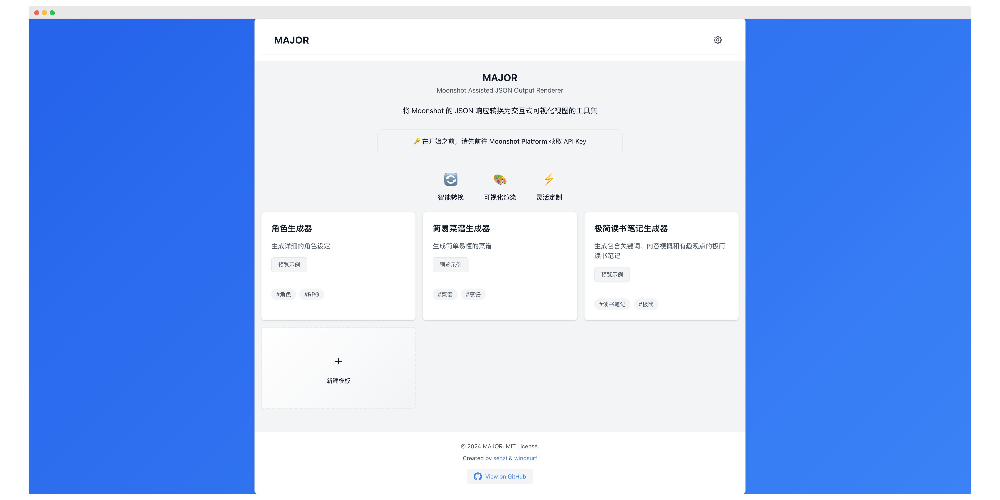

# MAJOR (Moonshot Assisted JSON Output Renderer)

MAJOR 是一个可视化工具包，专注于将 Moonshot API 的 JSON 模式响应转换为交互式和可定制的视图。它展示了如何通过结构化的 JSON 输出和预定义的渲染模板，来实现稳定、精美的 AI 生成内容可视化。

在线 Demo：[major.closeai.moe](https://major.closeai.moe)



## 设计理念

MAJOR 的核心理念是展示 AI 接口的 JSON 模式输出的优势：

1. **结构化输出**
   - 通过 JSON 模式限制 AI 输出的格式
   - 确保生成内容的一致性和可预测性
   - 便于数据的解析和处理

2. **模板渲染**
   - 预定义的 HTML/CSS 模板
   - 将结构化数据转换为精美的可视化界面
   - 支持自定义模板以适应不同场景

3. **可扩展性**
   - 易于添加新的模板和场景
   - 支持社区贡献新的可视化方案
   - 灵活的模板定制能力

## 特性介绍

### 内置模板
- 食谱生成器：展示菜品的原料和步骤
- 读书笔记生成器：整理书籍的关键信息
- 更多模板持续添加中...

### 自定义模板
- 可视化模板编辑器
- AI 辅助模板生成
- 实时预览功能

### Moonshot API 集成
- 使用 JSON 模式确保输出质量
- 智能解析自然语言指令
- 生成符合模板要求的数据结构

## 技术实现

- **前端框架**: Vue 3 + TypeScript
- **模板引擎**: Handlebars
- **AI 能力**: Moonshot API (JSON mode)
- **样式方案**: CSS Variables + Scoped CSS

## 项目结构

```
src/
├── components/    # 可复用组件
├── views/         # 页面视图
│   ├── HomeView.vue          # 首页展示
│   ├── ChatView.vue          # 对话界面
│   └── TemplateEditor.vue    # 模板编辑器
├── services/      # API 服务
├── data/          # 模板和场景定义
└── types/         # TypeScript 类型
```

## 快速开始

1. 克隆项目并安装依赖
```bash
git clone https://github.com/yourusername/MAJOR.git
cd MAJOR
npm install
```

2. 配置 Moonshot API
```bash
cp .env.example .env
# 编辑 .env 文件，设置你的 API Key
```

3. 启动开发服务器
```bash
npm run dev
```

## 使用指南

### 使用现有模板
1. 选择合适的模板
2. 输入自然语言描述
3. 获取生成的可视化内容

### 创建新模板
1. 定义数据结构（JSON 格式）
2. 设计渲染模板（HTML/CSS）
3. 编写系统提示词
4. 添加示例对话

### 最佳实践
- 设计清晰的 JSON 结构
- 编写详细的系统提示词
- 提供充分的示例对话
- 优化模板的可视化效果

## 贡献指南

我们欢迎社区贡献新的模板和改进建议！

1. Fork 项目
2. 创建特性分支
3. 提交改动
4. 发起 Pull Request

## 开源协议

[MIT License](LICENSE)

## 鸣谢

- [Moonshot AI](https://moonshot.cn/) - AI 能力支持
- [Handlebars](https://handlebarsjs.com/) - 模板引擎
- [Vue.js](https://vuejs.org/) - 前端框架
